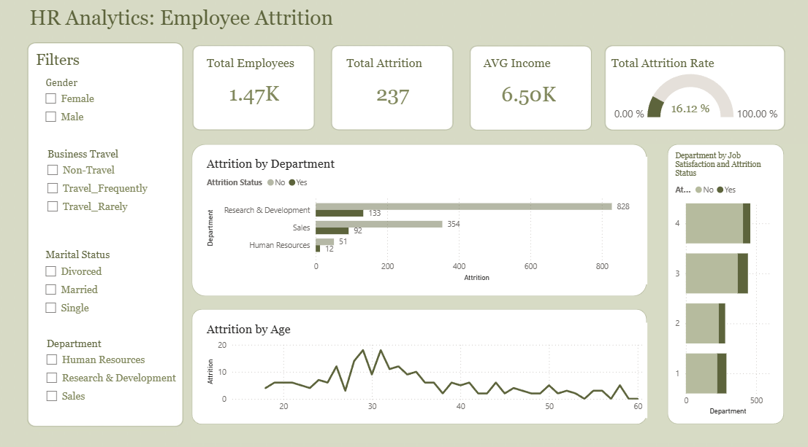

# HR Analytics & Employee Attrition Dashboard
## Dashborad Preview 

# Interactive Live Report

 Power BI Dashboard:

 https://app.powerbi.com/groups/me/reports/0fce6bb9-b676-4b96-83e7-9164051532d0/c0e2f2abb2c68b35eb72?experience=power-bi

 The dashboard is fully interactive and allows users to explore employee attrition trends using filters and slicers.

 # Project Overview

 Employee attrition is one of the most important challenges faced by organizations, as high turnover rates can impact productivity, employee morale, and business performance.

 This project aims to analyze HR data and identify factors associated with employee attrition using SQL Server and Power BI. The objective was to transform raw employee data into meaningful insights through data preparation, and interactive visualizations.

 The final dashboard helps stakeholders understand workforce trends and explore the relationship between employee turnover, age, department, income, and job satisfaction.

# Data Source 

 The dataset contains employee information including:
 * Age
 * Gender
 * Department
 * Monthly Income
 * Marital Status
 * Business Travel
 * Job Satisfaction
 * Attrition Status

 The data was processed and analyzed to identify patterns that may influence employee retention and turnover.

 # Data Extraction & Transformation

 The project started in SQL Server, where the dataset was imported and explored using SQL queries.

 Before loading the data into Power BI, SQL was used to prepare the dataset and perform initial transformations.

 The following tasks were completed:
 * Selected relevant columns required for analysis.
 * Explored employee demographics and workforce characteristics.
 * Created a numeric attrition indicator for aggregation and calculations.
 * Created a descriptive attrition status field to improve dashboard readability.

# SQL Transformation:

USE HR_Analytics;
GO

SELECT 
    [Age],
    [Department],
    [MonthlyIncome],
    [Gender],
    [MaritalStatus],
    [BusinessTravel],
    

    CASE 
        WHEN [Attrition] = 1 THEN 1
        ELSE 0 
    END AS [Attrition_Numeric],
    
   
    CASE 
        WHEN [Attrition] = 1 THEN 'Yes'
        ELSE 'No' 
    END AS [Attrition_Status]

FROM [HR-Employee-Attrition];

 Performing these transformations in SQL Server reduced preprocessing requirements and ensured a cleaner dataset before importing it into Power BI.

 # Data Preparation in Power BI

 After importing the transformed dataset into Power BI, additional preparation steps were performed using Power Query.

 The original attrition values ​​were further validated and prepared for reporting to ensure consistency across all visuals and filters.

 Data cleaning and transformation tasks included:
 * Reviewing data quality
 * Validating transformed columns
 * Preparing fields for visualization
 * Optimizing the dataset for reporting

 # DAX Measure

DAX measures were used to support dashboard calculations and ensure proper synchronization between the transformed data and the original dataset structure.
The primary business metric created was:

Attrition rate
Calculates the percentage of employees who left the company relative to the total workforce.

Attrition Rate =
Attrition_For_Gauge = 'Query1'[Attrition_Numeric]

Additional supporting measures were used to maintain accurate filtering behavior and consistent dashboard interactions across visuals and slicers.
These measures ensure that dashboard insights update dynamically based on user selections

# Dashboard Features

 The dashboard contains several interactive components designed to help users explore employee attrition trends.

 KPI Cards

 * Total Employees
 * Total Attrition
 * Average Monthly Income
 * Attrition Rate

 Interactive Filters

 Users can filter the dashboard by:
 * Gender
 * Department
 * Marital Status
 * Business Travel

 Attrition by Department
 Analyzes employee turnover across departments and identifies areas with the highest attrition levels.

 Attrition by Age
 Shows attrition patterns across different age groups.

 Attrition by Job Satisfaction
 Examines the relationship between employee satisfaction and turnover.

# Key Insights

 Several important findings were identified during the analysis:
 * Research & Development recorded the highest number of employee attrition cases.
 * Employee turnover was most common among employees aged 28–32 years.
 * Employees with lower job satisfaction levels showed a higher likelihood of leaving the company.
 * Attrition patterns differed across departments and demographic groups.

 These insights can help organizations develop targeted employee retention strategies.

 # Tools & Technologies
 
* Database: SQL Server (SQL Queries)
* BI & Analytics: Power BI Desktop, Power Query, DAX
* Cloud Deployment: Power BI Service

# Skills Demonstrated

* SQL Querying & ETL Processes
* Data Cleaning & Transformation
* DAX Calculations
* Business Intelligence Reporting & Dashboard Development
* HR Analytics & KPI Development
* Interactive Reporting & Data Visualization

# Conclusion

This project demonstrates a complete Business Intelligence workflow, beginning with data extraction and transformation in SQL Server, followed by data preparation in Power BI, and ending with the development of an interactive HR analytics dashboard.
The dashboard provides valuable insights into employee attrition trends and workforce behavior, enabling data-driven decision-making and supporting employee retention initiatives.

